# Enemy Behavior Tree 구조

## Mermaid Diagram

```mermaid
graph TD
    Root["Root (MySelector)"]
    
    %% 1. 최우선 - 사망
    Root --> Dead["1. IsDead"]
    Dead -->|"Running (사망)" | DeadLoop["사망 상태 유지"]
    Dead -->|"Failure (생존)"| Next1[다음 노드]
    
    %% 2. 두번째 우선 - 스턴
    Root --> Stunned["2. IsStunned"]
    Stunned -->|"Running (스턴)"| StunnedLoop["스턴 상태 유지"]
    Stunned -->|"Failure (정상)"| Next2[다음 노드]
    
    %% 3. 원거리 공격 진행 중
    Root --> ShootSeq1["3. 원거리 공격 진행<br/>(MySequence)"]
    ShootSeq1 --> ShouldContinueShoot["ShouldContinueShoot"]
    ShouldContinueShoot -->|Success| ShootAtPlayer["ShootAtPlayer<br/>(애니메이션 + 발사)"]
    ShouldContinueShoot -->|Failure| Next3[다음 노드]
    
    %% 4. 원거리 공격 시작
    Root --> ShootSeq2["4. 원거리 공격 시작<br/>(MySequence)"]
    ShootSeq2 --> CheckShootRange["CheckShootRange<br/>(원거리 범위 체크)"]
    CheckShootRange -->|Success| CommitToShoot["CommitToShoot<br/>(공격 커밋)"]
    CheckShootRange -->|Failure| Next4[다음 노드]
    
    %% 5. 근접 공격 진행 중
    Root --> AttackSeq1["5. 근접 공격 진행<br/>(MySequence)"]
    AttackSeq1 --> ShouldContinueAttack["ShouldContinueAttack"]
    ShouldContinueAttack -->|Success| AttackPlayer["AttackPlayer<br/>(애니메이션 실행)"]
    ShouldContinueAttack -->|Failure| Next5[다음 노드]
    
    %% 6. 근접 공격 시작
    Root --> AttackSeq2["6. 근접 공격 시작<br/>(MySequence)"]
    AttackSeq2 --> CheckPlayerInRange["CheckPlayerInRange<br/>(근접 범위 체크)"]
    CheckPlayerInRange -->|Success| CommitToAttack["CommitToAttack<br/>(공격 커밋)"]
    CheckPlayerInRange -->|Failure| Next6[다음 노드]
    
    %% 7. 추격
    Root --> ChaseSeq["7. 플레이어 추격<br/>(MySequence)"]
    ChaseSeq --> CheckChaseRange["CheckChaseRange<br/>(추격 범위 체크)"]
    CheckChaseRange -->|Success| ChasePlayer["ChasePlayer<br/>(이동 + MOVE 애니메이션)"]
    CheckChaseRange -->|Failure| Next7[다음 노드]
    
    %% 8. 대기
    Root --> Idle["8. IDLE<br/>(대기 상태)"]
    
    %% 스타일
    style Root fill:#ff9999,stroke:#333,stroke-width:3px
    style Dead fill:#ffcccc,stroke:#333
    style Stunned fill:#ffcccc,stroke:#333
    style ShootSeq1 fill:#99ccff,stroke:#333
    style ShootSeq2 fill:#99ccff,stroke:#333
    style AttackSeq1 fill:#99ff99,stroke:#333
    style AttackSeq2 fill:#99ff99,stroke:#333
    style ChaseSeq fill:#ffff99,stroke:#333
    style Idle fill:#cccccc,stroke:#333
    style DeadLoop fill:#ff6666
    style StunnedLoop fill:#ff9999
    style ShootAtPlayer fill:#6699ff
    style CommitToShoot fill:#6699ff
    style AttackPlayer fill:#66ff66
    style CommitToAttack fill:#66ff66
    style ChasePlayer fill:#ffff66
```



## 트리 구조 설명

### 📊 노드 타입
- **Selector (OR)**: 자식 노드를 순서대로 실행, 하나라도 Success면 Success
- **Sequence (AND)**: 자식 노드를 순서대로 실행, 모두 Success여야 Success
- **Leaf**: 실제 행동 또는 조건 체크

### 🔴 우선순위 (위에서 아래로)

1. **IsDead** (사망 체크)
   - 사망 상태면 Running 반환 → 다른 노드 실행 안 함
   
2. **IsStunned** (스턴 체크)
   - 스턴 상태면 Running 반환 → 다른 노드 실행 안 함

3. **원거리 공격 진행 중**
   - `ShouldContinueShoot` → `ShootAtPlayer`
   - 이미 커밋된 원거리 공격 완료까지 실행

4. **원거리 공격 시작**
   - `CheckShootRange` → `CommitToShoot`
   - 원거리 범위 내이고 공격 가능하면 원거리 공격 시작

5. **근접 공격 진행 중**
   - `ShouldContinueAttack` → `AttackPlayer`
   - 이미 커밋된 근접 공격 완료까지 실행

6. **근접 공격 시작**
   - `CheckPlayerInRange` → `CommitToAttack`
   - 근접 범위 내면 근접 공격 시작

7. **추격**
   - `CheckChaseRange` → `ChasePlayer`
   - 추적 범위 내면 플레이어를 쫓아감

8. **대기**
   - 아무 조건도 만족하지 않으면 IDLE 상태

---

## 상세 노드 설명

### 조건 노드 (Condition)

| 노드 | 설명 | 반환 |
|------|------|------|
| `IsDead` | Enemy가 사망했는지 | Running(사망) / Failure(생존) |
| `IsStunned` | Enemy가 스턴 상태인지 | Running(스턴) / Failure(정상) |
| `ShouldContinueShoot` | 원거리 공격 커밋 중인지 | Success / Failure |
| `CheckShootRange` | 원거리 범위 내인지 (근접 범위 밖) | Success / Failure |
| `ShouldContinueAttack` | 근접 공격 커밋 중인지 | Success / Failure |
| `CheckPlayerInRange` | 근접 범위 내인지 | Success / Failure |
| `CheckChaseRange` | 추적 범위 내인지 | Success / Failure |

### 행동 노드 (Action)

| 노드 | 설명 | 동작 |
|------|------|------|
| `ShootAtPlayer` | 원거리 공격 실행 | 애니메이션 재생, 총알 발사 |
| `CommitToShoot` | 원거리 공격 커밋 | 방향 회전, 커밋 플래그 설정 |
| `AttackPlayer` | 근접 공격 실행 | 애니메이션 재생 |
| `CommitToAttack` | 근접 공격 커밋 | 방향 회전, 커밋 플래그 설정 |
| `ChasePlayer` | 플레이어 추격 | 이동, MOVE 애니메이션 |
| `IDLE` | 대기 | IDLE 애니메이션 |

---

## 🎯 Attack Commit 시스템

Enemy는 **Attack Commit** 시스템을 사용하여 공격을 중단 없이 완료합니다:

1. **CheckShootRange/CheckPlayerInRange**: 범위 체크
2. **CommitToShoot/CommitToAttack**: 공격 커밋 (`_isShootCommitted = true`)
3. **ShootAtPlayer/AttackPlayer**: 애니메이션 완료까지 실행
4. 애니메이션 완료 후 커밋 해제

**장점:**
- ✅ 공격 중 다른 행동으로 전환 방지
- ✅ 예측 가능한 AI → 플레이어가 패턴 학습 가능
- ✅ 애니메이션이 자연스럽게 완료됨

---

## 📈 실행 흐름 예시

### 예시 1: 원거리 Enemy가 플레이어 발견
```
1. IsDead → Failure (생존)
2. IsStunned → Failure (정상)
3. ShouldContinueShoot → Failure (공격 중 아님)
4. CheckShootRange → Success (원거리 범위 내)
   → CommitToShoot → Success (공격 커밋)
   → Selector가 Success 반환하고 종료
   
다음 프레임:
1. IsDead → Failure
2. IsStunned → Failure
3. ShouldContinueShoot → Success (공격 커밋 중)
   → ShootAtPlayer → Running (애니메이션 진행 중)
   → Selector가 Running 반환
```

### 예시 2: 근접 Enemy가 플레이어 추격 중
```
1. IsDead → Failure
2. IsStunned → Failure
3. ShouldContinueShoot → Failure (원거리 공격 없음)
4. CheckShootRange → Failure (원거리 범위 밖)
5. ShouldContinueAttack → Failure (공격 중 아님)
6. CheckPlayerInRange → Failure (근접 범위 밖)
7. CheckChaseRange → Success (추적 범위 내)
   → ChasePlayer → Running (추격 중)
   → Selector가 Running 반환
```

### 예시 3: Enemy가 피격으로 스턴
```
1. IsDead → Failure (생존)
2. IsStunned → Running (스턴!)
   → Selector가 Running 반환하고 종료
   (다른 노드 실행 안 함)
```

---

## 🔧 코드로 BT 구조 내보내기 (선택사항)

아래 코드를 `MyBT.cs`에 추가하면 에디터에서 BT 구조를 출력할 수 있습니다:

```csharp
#if UNITY_EDITOR
[ContextMenu("Print Behavior Tree Structure")]
private void PrintBehaviorTreeStructure()
{
    Debug.Log("=== Behavior Tree Structure ===");
    Debug.Log("Root: MySelector");
    Debug.Log("  1. IsDead (Leaf)");
    Debug.Log("  2. IsStunned (Leaf)");
    Debug.Log("  3. 원거리 공격 진행 (Sequence)");
    Debug.Log("     - ShouldContinueShoot (Leaf)");
    Debug.Log("     - ShootAtPlayer (Leaf)");
    Debug.Log("  4. 원거리 공격 시작 (Sequence)");
    Debug.Log("     - CheckShootRange (Leaf)");
    Debug.Log("     - CommitToShoot (Leaf)");
    Debug.Log("  5. 근접 공격 진행 (Sequence)");
    Debug.Log("     - ShouldContinueAttack (Leaf)");
    Debug.Log("     - AttackPlayer (Leaf)");
    Debug.Log("  6. 근접 공격 시작 (Sequence)");
    Debug.Log("     - CheckPlayerInRange (Leaf)");
    Debug.Log("     - CommitToAttack (Leaf)");
    Debug.Log("  7. 추격 (Sequence)");
    Debug.Log("     - CheckChaseRange (Leaf)");
    Debug.Log("     - ChasePlayer (Leaf)");
    Debug.Log("  8. IDLE (Leaf)");
}
#endif
```

**사용 방법:**
1. Unity 에디터에서 Enemy 선택
2. Inspector에서 `MyBT` 컴포넌트의 `⋮` 메뉴 클릭
3. `Print Behavior Tree Structure` 선택
4. Console에 BT 구조 출력

---

## 📊 통계

- **총 노드 수**: 16개
- **Selector 노드**: 1개 (Root)
- **Sequence 노드**: 5개
- **Leaf 노드**: 10개
- **최대 깊이**: 3단계

이 BT 구조는 **우선순위 기반 AI**로, 상위 조건이 만족되면 하위 노드는 실행되지 않습니다.

